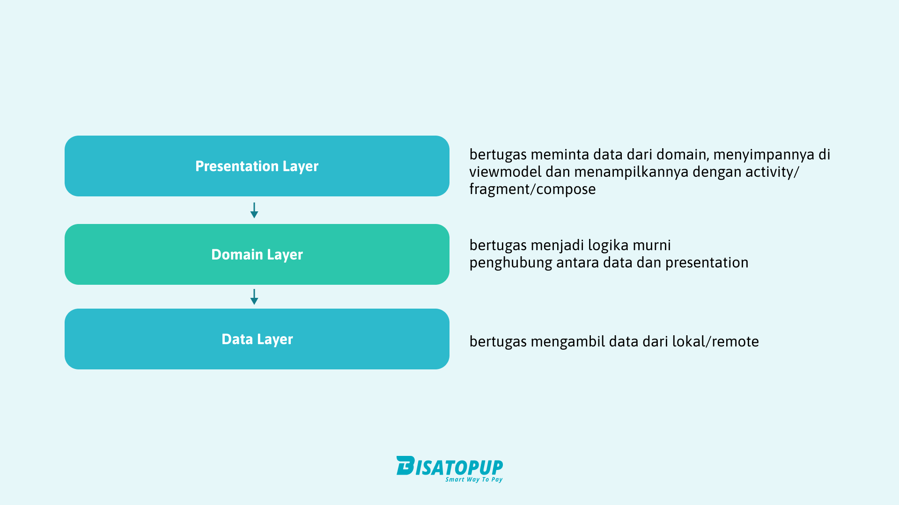
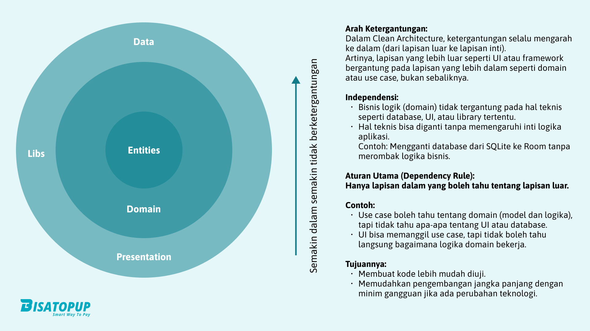

Pada pengembangan projek, kita memiliki nilai-nilai atau prinsip yang menjadi acuan seperti apa kode harus ditulis. Prinsip ini yang dielaborasikan kemudian pada penulisan kodingan. 

Dalam dokumentasi ini prinsip dijabarkan dengan singkat, dengan harapan dapat lebih mudah dipahami.

## Clean Architecture  
Clean Architecture adalah prinsip desain perangkat lunak yang bertujuan untuk membuat aplikasi mudah di-maintain, scalable, dan modular. Dalam konteks pengembangan aplikasi seperti Bisatopup, Clean Architecture memastikan bahwa setiap lapisan aplikasi memiliki tanggung jawab yang jelas dan independen.  

### Karakteristik Utama Clean Architecture:  
1. **Lapisan Terpisah**:  
   - **Presentation Layer**: Bertanggung jawab atas interaksi dengan pengguna (UI/UX).  
   - **Domain Layer**: Tempat logika bisnis utama dijalankan.  
   - **Data Layer**: Berisi akses ke sumber data seperti API, database, atau file lokal.  

   

2. **Ketergantungan Terbalik (Dependency Inversion Principle)**: Domain Layer tidak bergantung pada detail implementasi, melainkan detail yang bergantung pada domain.  

   

3. **Testability**: Setiap lapisan mudah diuji karena terpisah dan memiliki tanggung jawab masing-masing.  

Implementasi Clean Architecture memungkinkan tim untuk menambahkan fitur baru tanpa mengganggu sistem yang sudah ada, serta mempermudah debugging dan perawatan aplikasi.  

---

## MVP (Model-View-Presenter)  
MVP adalah pola desain perangkat lunak yang memisahkan logika presentasi dari logika bisnis untuk memastikan UI dan backend aplikasi tidak saling terikat.  

### Komponen Utama MVP:  
1. **Model**: Mengelola data aplikasi dan logika bisnis.  
2. **View**: Bertanggung jawab untuk menampilkan data dan menerima input dari pengguna.  
3. **Presenter**: Menghubungkan View dan Model, serta mengatur logika interaksi antara keduanya.  

MVP sangat cocok untuk aplikasi seperti Bisatopup karena:  
- Meningkatkan keterbacaan dan pengorganisasian kode.  
- Memudahkan pengujian unit pada Presenter.  
- Membantu mempertahankan struktur yang bersih dan modular.  

---

## KEEP IT SIMPLE  
Prinsip **KEEP IT SIMPLE** menekankan bahwa solusi terbaik sering kali adalah yang paling sederhana. Dalam pengembangan perangkat lunak, menjaga kode tetap sederhana berarti:  
- Menghindari over-engineering.  
- Membuat kode mudah dipahami oleh semua anggota tim.  
- Fokus pada kebutuhan bisnis utama tanpa menambahkan fitur yang tidak diperlukan.  

Dengan menjaga kesederhanaan, tim dapat:  
- Mengurangi kemungkinan bug.  
- Mempercepat waktu pengembangan dan perawatan aplikasi.  
- Mempermudah pengembangan fitur baru di masa depan.  

---

## DON'T REPEAT YOURSELF (DRY)  
Prinsip **DON'T REPEAT YOURSELF** mengajarkan untuk tidak menulis kode yang sama berulang kali. DRY bertujuan untuk meningkatkan efisiensi pengembangan dengan memanfaatkan abstraksi, fungsi reusable, dan modul.  

### Manfaat DRY:  
1. **Mengurangi Duplikasi Kode**: Setiap perubahan hanya perlu dilakukan di satu tempat.  
2. **Meningkatkan Keterbacaan Kode**: Kode yang lebih ringkas dan terorganisasi.  
3. **Mengurangi Potensi Error**: Karena tidak ada kode yang duplikat, risiko inkonsistensi menurun.  

Contoh implementasi DRY dalam Bisatopup adalah memanfaatkan fungsi utility untuk format tanggal, validasi input, atau pengelolaan API.  

---

## SEPARATION OF CONCERN (SoC)  
Prinsip **Separation of Concern** adalah pembagian tanggung jawab dalam aplikasi menjadi bagian-bagian yang terisolasi berdasarkan fungsinya. Dengan SoC, setiap bagian kode hanya fokus pada satu tugas utama.  

### Contoh dalam Aplikasi Bisatopup:  
1. **Presentation**: Bertanggung jawab atas UI/UX.  
2. **Business Logic**: Mengelola aturan dan proses yang spesifik untuk bisnis.  
3. **Data Access**: Menangani interaksi dengan API eksternal atau database.  

### Keuntungan SoC:  
- **Pemeliharaan Mudah**: Perubahan pada satu bagian tidak memengaruhi bagian lain.  
- **Pengujian Efisien**: Setiap bagian dapat diuji secara independen.  
- **Pengembangan Paralel**: Tim dapat bekerja pada lapisan yang berbeda secara bersamaan.  

SoC membantu tim menjaga konsistensi dan fleksibilitas aplikasi, memungkinkan pengembangan yang lebih cepat dan pengurangan risiko bug.  
