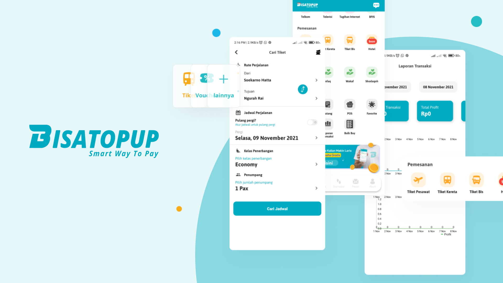

بسم الله الرحمن الرحيم 
الحمد لله والصلاة والسلام على رسول الله

Segala puji untuk Allah Ta'ala, Rabb Yang Maha Kuasa, satu-satunya yang berhak diibadahi. Tidak ada daya dan upaya kecuali dari Allah yang Maha Pengasih.

Semoga Shalawat dan salam senantiasa tercurah kepada Nabi yang mulia, Muhammad bin Abdillah, beserta keluarga dan sahabat.

Semoga senantiasa Allah limpahkan keberkahan untuk segenap tim Amanah Corp dan Bisatopup Indonesia, dan menjadikan kebaikan dalam usaha kita agar menjadi manfaat untuk dunia dan akhirat kita. 

## Pengantar

Selamat datang di dokumentasi lengkap Bisatopup! Kami sangat senang dapat membawa Anda menjelajahi dunia Bisatopup, aplikasi yang telah membantu jutaan pengguna di Indonesia untuk melakukan berbagai transaksi digital dengan mudah dan cepat. Sejak pertama kali diluncurkan pada tahun 2014, Bisatopup telah berkembang pesat, memberikan kenyamanan bagi pengguna dalam memenuhi kebutuhan sehari-hari hanya dengan menggunakan smartphone mereka.

### Sejarah Bisatopup

Bisatopup adalah produk platform Payment Point Online Bank (PPOB) berbasis aplikasi Android yang dikembangkan oleh PT. Bisatopup Teknologi Indonesia.

Sejak didirikan pada tahun 2014, Bisatopup telah berkomitmen untuk menyediakan solusi pembayaran digital yang cepat, praktis, dan aman bagi masyarakat Indonesia. Awalnya, Bisatopup fokus pada layanan pembelian pulsa dan token listrik. Namun, seiring berjalannya waktu, layanan Bisatopup berkembang pesat untuk mencakup berbagai transaksi penting lainnya, seperti pembayaran tagihan air, internet, TV kabel, dan pembelian voucher game. Dengan demikian, Bisatopup telah menjadi aplikasi yang dipercaya untuk menyelesaikan berbagai kebutuhan transaksi digital dengan cara yang lebih mudah, aman, dan efisien.

### Visi dan Misi

Visi Bisatopup adalah menjadi perusahaan fintech syariah nomor satu di Indonesia.

Untuk mencapai visi tersebut, Bisatopup memiliki misi sebagai berikut:

- Menjadikan aplikasi pilihan utama bagi pelanggan dalam berbagai top-up digital.
- Mengembangkan bisnis atas dasar nilai-nilai syariah.
- Melakukan pembaruan teknologi yang melampaui harapan pelanggan.
- Meningkatkan kualitas fitur dan layanan pelanggan.

### Produk dan Layanan

Bisatopup menawarkan berbagai produk dan layanan, antara lain:

- **Pembelian Pulsa dan Paket Data:** Memungkinkan pengguna untuk membeli pulsa dan paket data dari berbagai operator telekomunikasi di Indonesia.
- **Pembelian Token Listrik:** Memudahkan pengguna untuk membeli token listrik prabayar tanpa harus pergi ke minimarket atau loket pembayaran.
- **Pembayaran Tagihan:** Menyediakan layanan pembayaran tagihan air, internet, TV kabel, dan berbagai tagihan lainnya secara online.
- **Produk Original Bisatopup Official Store:** Menyediakan berbagai produk original Bisatopup, seperti produk aqiqah, qurban, dan merchandise.

### Keunggulan Bisatopup

- **Kemudahan Transaksi:** Semua layanan dapat diakses melalui aplikasi Bisatopup yang tersedia di platform Android dan iOS, memungkinkan pengguna untuk melakukan transaksi kapan saja dan di mana saja.
- **Keamanan:** Bisatopup mengutamakan keamanan data dan transaksi pengguna dengan sistem keamanan yang canggih dan terpercaya.
- **Harga Terjangkau:** Bisatopup selalu berusaha memberikan harga yang kompetitif dan terjangkau bagi semua pengguna. 
- **Layanan Pelanggan:** Bisatopup menyediakan layanan pelanggan yang siap membantu 24 jam melalui berbagai saluran komunikasi, termasuk email, live chat, dan WhatsApp.

### Sertifikasi dan Lisensi

Bisatopup telah memperoleh berbagai sertifikasi dan lisensi yang menunjukkan komitmennya terhadap kualitas dan keamanan, antara lain:

- **ISO/IEC 27001:** Sertifikasi manajemen keamanan informasi.
- **Tanda Daftar Kominfo:** Penyelenggara Sistem Elektronik dengan nomor 000659.01/DJAI.PSE/05/2021.
- **Tervalidasi untuk Akad & SOP Sesuai Syariah:** Sertifikasi dengan nomor AKI-2001.

### Lokasi Kantor

PT. Bisatopup Teknologi Indonesia beralamat di Ruko Griya Cakra No.6, Jl. RTM Kelapa Dua, Cimanggis, Kota Depok 16451. 

### Dokumentasi Bisatopup

Dokumentasi ini hadir untuk memberikan penjelasan yang lengkap tentang Bisatopup, baik dari sisi teknis untuk para pengembang, maupun informasi yang berguna bagi pengguna umum. Di dalamnya, Anda akan menemukan berbagai panduan dan informasi tentang cara kerja aplikasi, cara mengembangkan fitur-fitur baru, serta cara memanfaatkan aplikasi Bisatopup secara maksimal. Kami berharap dokumentasi ini dapat menjadi sumber daya yang bermanfaat, baik bagi tim teknis yang membangun Bisatopup maupun bagi pengguna yang ingin mengetahui lebih dalam tentang aplikasi ini.

Melalui dokumentasi ini, kami ingin memastikan setiap orang dapat memahami dan memanfaatkan Bisatopup dengan mudah. Kami berharap, dengan memahami aplikasi ini lebih dalam, Anda akan semakin menikmati kemudahan yang ditawarkan oleh Bisatopup dalam kehidupan sehari-hari.

Terima kasih sudah menjadi bagian dari perjalanan Bisatopup. Kami percaya aplikasi ini adalah sebuah produk yang sangat berarti bagi kita semua, dan bersama-sama kita akan terus mengembangkan Bisatopup untuk memberikan lebih banyak manfaat bagi masyarakat Indonesia.

Jazakumullah khoiron